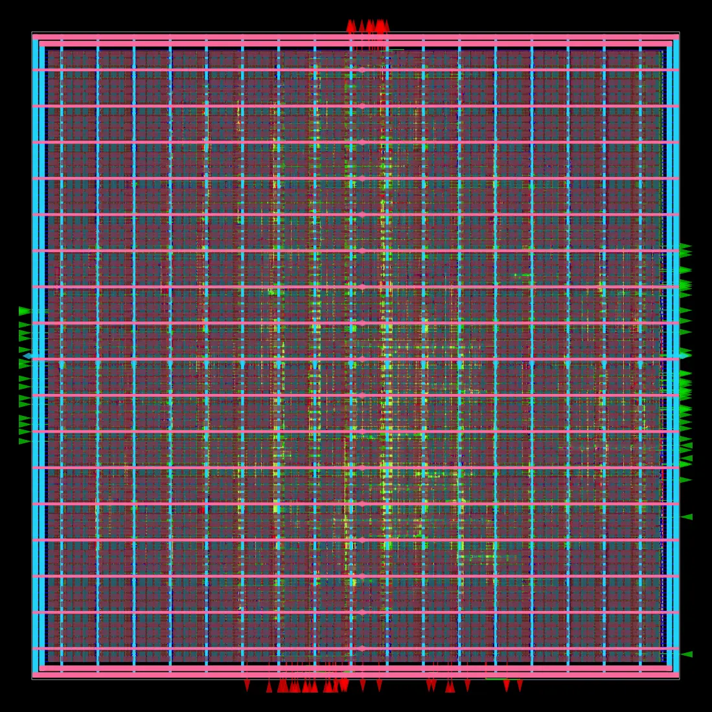
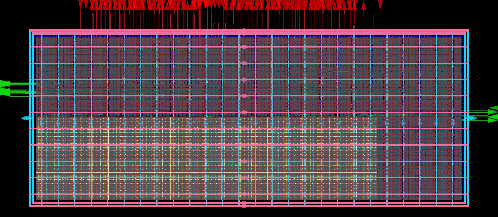
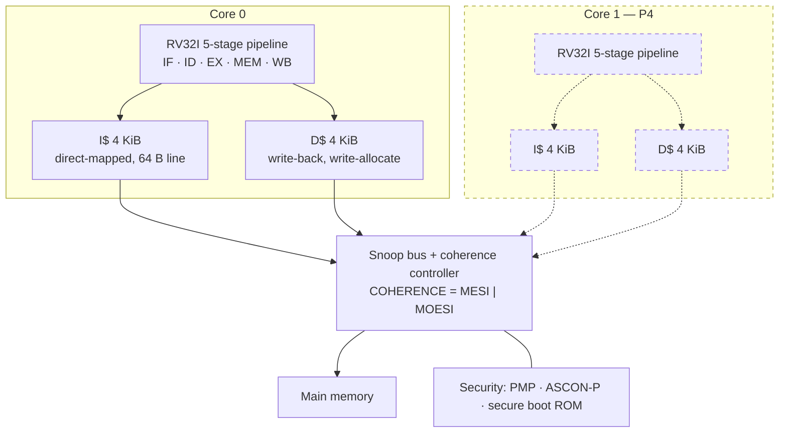
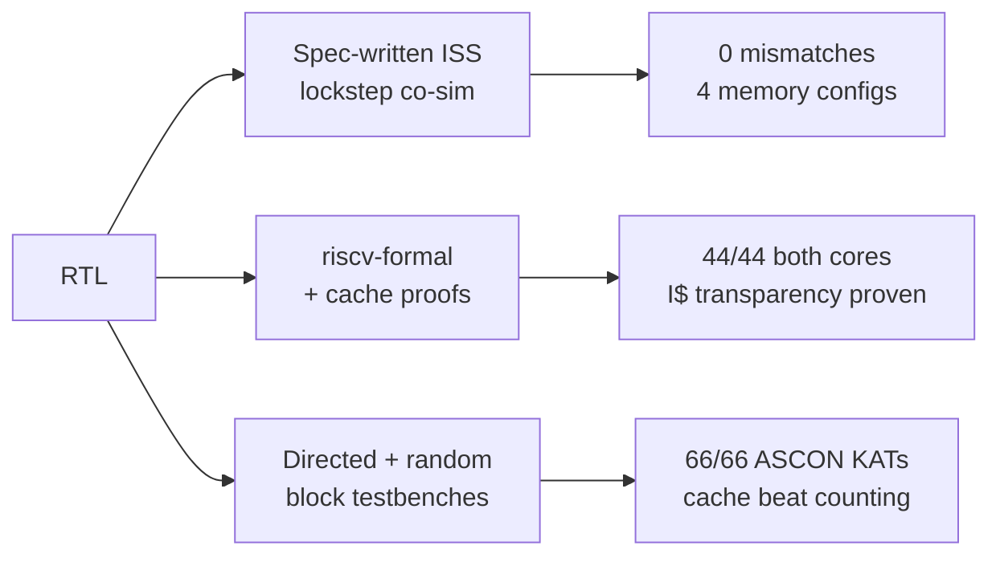
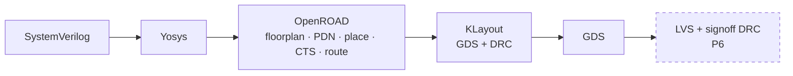

# TinyTrust

A dual-core, cache-coherent RV32I SoC built from scratch for tape-out on
[IHP SG13G2](https://github.com/IHP-GmbH/IHP-Open-PDK) 130 nm open silicon —
RTL through GDS with an open-source flow.

The point of the project is **microarchitecture depth demonstrated on real
silicon**: a 5-stage pipeline, private L1 caches on real SRAM macros, and a
snooping coherence protocol implemented twice — MESI and MOESI — on identical
RTL so the two can be *measured* against each other rather than described.

Every number below is measured on this repo's own flows. Nothing here is an
estimate unless it says so.

---

## Where it stands

| | |
|---|---|
| **First GDS** | ✅ clean, 0 router DRC violations, on IHP SG13G2 |
| **f_max** | **144.11 MHz** (core-only harden, +3.06 ns slack at the 10 ns constraint) |
| **CPI** | **7.62 → 2.55**, a **2.99×** speedup from multicycle to pipelined + cached |
| **riscv-formal** | **44/44** on both cores, independently measured |
| **ISS lockstep** | 0 mismatches across 4 memory configurations |
| **Caches** | 4 KiB I$ + 4 KiB D$ on real `RM_IHPSG13_1P_512x64` SRAM macros |
| **Now** | P4 — two cores, shared bus, MESI coherence |

<table>
<tr>
<td width="50%"><br>
<sub><b>P0</b> — the v1 core hardened to GDS. 640 × 640 µm, 42% utilization,
19.7 mW. Pink/cyan are PDN straps.</sub></td>
<td width="50%"><br>
<sub><b>SRAM smoke test</b> — one 4 KiB macro through the full flow, to retire
the OpenROAD/BITKIT GDS-merge risk before committing the cache design.</sub></td>
</tr>
</table>

---

## Architecture

Solid lines are built and verified. Dashed lines are the next milestone.



**Why two cores and not four.** Two cores exercise every MESI/MOESI transition
including the O-state cache-to-cache dirty transfer that distinguishes them.
Four multiply verification cost without adding a single protocol state.

**Why one controller with a parameter, not two.** `COHERENCE = MESI | MOESI`
on identical RTL and identical stimulus yields a *comparison* — writeback
traffic and shared-line latency, measured. That comparison is the deliverable;
the protocol itself is table stakes.

---

## The result the project is built around

v1's design principle was area-first, and it argued a pipeline was not worth it
because throughput is wasted stalling on slow fetch. v2 reversed that. The
reversal is now measured across three configurations on the same RTL:

| `loop_bench`, 5,164 instructions | CPI | vs. multicycle |
|---|---|---|
| multicycle core, no cache | 7.62 | — |
| 5-stage core, no cache | 6.29 | 1.21× |
| **5-stage core + I$ and D$** | **2.55** | **2.99×** |

The pipeline alone buys 1.21× — a thin return for +31% area, and v1 was
*mostly right*. The pipeline with caches buys 2.99×. Neither half is worth much
alone, which is the actual finding: **P2 without P3 would not have been worth
doing**, and now there is a number saying so instead of an assertion.

That benchmark had to be written first. Every existing test was straight-line
code executed once — the worst case for a cache, where a 64 B line pulls in 16
instructions each used exactly once. The suite could not measure the milestone
it was meant to measure.

---

## Verification

The design is verified three ways, and they catch different things.



| Leg | Result |
|---|---|
| ISS lockstep co-sim | 22 programs × 18,973 instructions × 4 memory configs, **0 mismatches** |
| riscv-formal | **44/44** on the multicycle core *and* the 5-stage core, both measured |
| Cache transparency (formal) | **I$ PASS** at depth 26, with a non-vacuity witness |
| ASCON-P | **66/66** KATs against pyascon |
| Cache block TB | Beat counting: a hit generates 0 memory beats, a cold miss exactly 16, a dirty eviction exactly 32 |

**Open, and stated as open:** the D$ transparency proof does not close. BMC
needs depth 28 to reach an eviction and costs ~4× per step, which puts it out
of reach by orders of magnitude. The route through is k-induction or a
decomposed property — P4 machinery, so P4 inherits it. Details in
[RETARGET.md §10.5](docs/RETARGET.md).

Two defects in the *verification setup itself* were found closing that out,
neither of which would have shown up in a passing result: a non-vacuity guard
that had never executed because of a `mode bmc` / `mode cover` mismatch, and a
proof bound set below the depth at which the behaviour being proven can occur.

---

## Physical flow



Toolchain built natively in WSL2 by [`pd/setup_wsl.sh`](pd/setup_wsl.sh):
OpenROAD `26Q3-1278`, Yosys `0.68+`, KLayout `0.30.7`.

### Measured silicon numbers

| | |
|---|---|
| Core area (P0 harden) | 409,969 µm² @ 42% utilization |
| f_max | 144.11 MHz (period_min 6.94 ns) |
| WNS / TNS | 0.00 / 0.00 |
| Router DRC | **0 violations** |
| Power | 19.7 mW (42.6% sequential, 28.9% combinational, 28.5% clock) |
| 4 KiB SRAM macro | 150,102 µm² = **20.68 kGE**, and 66.6% of total power |
| Multicycle core | 18.97 kGE, 1,419 flops |

Two upstream defects were found and worked around getting here, both worth
reporting: ORFS documents `ADDITIONAL_LIBS` as used "throughout all stages"
when only `ADDITIONAL_*_LIBS` reach OpenSTA, and **all ten** IHP SRAM Liberty
files declare `max_capacitance` in farads under a `capacitive_load_unit(1,pf)`
declaration — off by 1e12, which aborts the resizer.

---

## Roadmap

| | Milestone | Status |
|---|---|---|
| **P0** | Backend bring-up, first GDS | ✅ 2026-08-28 |
| **P1** | Recalibrate area against sg13g2 | ✅ 2026-08-28 |
| **P2** | 5-stage pipeline | ✅ 2026-08-30 |
| **P3** | Caches on SRAM macros | ✅ 2026-09-03 — one criterion knowingly open |
| **P4** | **2 cores, shared bus, MESI** | ⬅ **in progress** |
| **P5** | MOESI + the MESI/MOESI measurement | |
| **P6** | Pad ring, full-chip P&R, timing closure, DRC + LVS | |
| **P7** | IHP Open Silicon MPW submission | |

---

## Documentation

This project documents its reasoning, not just its results — including the
decisions that were reversed and what that cost.

| | |
|---|---|
| [RETARGET.md](docs/RETARGET.md) | **Start here.** The v2 plan, every decision, and the measured milestone results |
| [ARCHITECTURE.md](docs/ARCHITECTURE.md) | v1 architecture spec — superseded in parts, kept legible on purpose |
| [VPLAN.md](docs/VPLAN.md) | Verification plan: feature → testpoint → method |
| [BUGLOG.md](docs/BUGLOG.md) | Every bug found, how it was found, and what it cost |
| [PROJECT_BOOK.md](docs/PROJECT_BOOK.md) | Full project manual (v1-era) |

## Layout

```
rtl/core     core.v (multicycle), core_p5.v (5-stage), regfile, pmp
rtl/cache    cache.v — parameterizable I$/D$, SRAM-macro backed
rtl/periph   ascon_p permutation accelerator
rtl/soc      (P4: bus, coherence controller, top level)
dv/core_iss  spec-written ISS + lockstep co-simulation
dv/formal    riscv-formal harness + cache transparency proofs
dv/cache     cache block testbenches
pd/          OpenROAD flow configs, results, die renders
synth/       area calibration against sg13g2 liberty
```

## Reproducing

```powershell
.\dv\formal\run.ps1 -Core p5      # riscv-formal, 5-stage core
.\dv\formal\cache\run.ps1         # cache proofs (bmc + non-vacuity covers)
.\dv\core_iss\run.ps1             # ISS lockstep co-simulation
```

```bash
# Physical flow, in WSL
source /opt/OpenROAD-flow-scripts/env.sh
make DESIGN_CONFIG=/mnt/e/tinytrust/pd/designs/tinytrust_core/config.mk
```

## License

Apache-2.0. The ASCON algorithm is per NIST SP 800-232 (public domain design).
