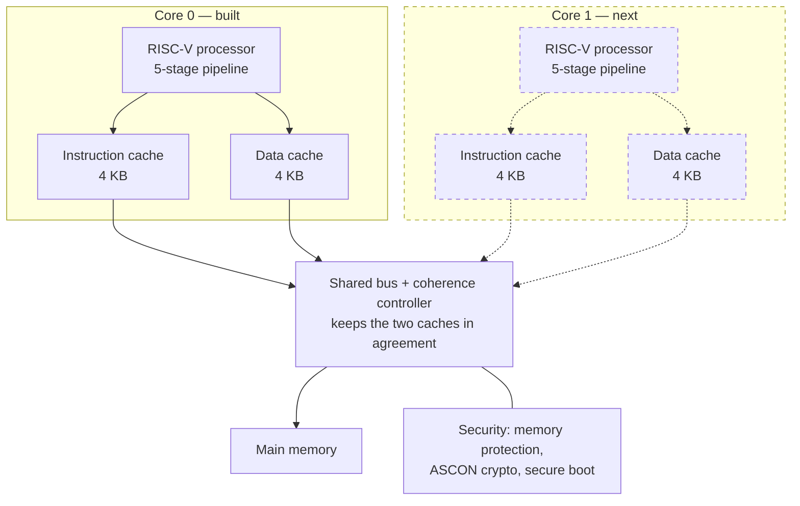
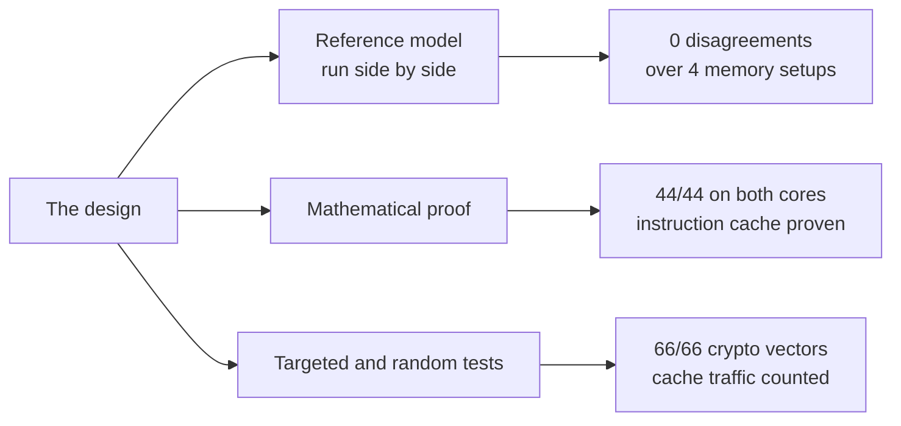

# TinyTrust

**A two-core RISC-V processor chip, designed from scratch and built for real
manufacturing.**

This is a complete processor design, written from nothing, taken all the way
from source code to a factory-ready layout using only open-source tools. The
target is [IHP SG13G2](https://github.com/IHP-GmbH/IHP-Open-PDK), a 130 nm
manufacturing process that anyone can use for free.

What makes it interesting is the memory system. When two processor cores each
keep a private copy of the same data, they can end up disagreeing with each
other. Keeping them in agreement is called **cache coherence**, and it is one
of the harder things to get right in a processor. There are several standard
protocols for it. This project builds two of them — MESI and MOESI — from the
same source, so they can be **measured** against each other rather than just
described.

Every number on this page was measured by the scripts in this repository. If
something is an estimate, it says so.

---

## What works right now

| | |
|---|---|
| **Factory-ready layout** | ✅ produced, with zero layout rule violations |
| **Clock speed** | **144 MHz** (processor core on its own) |
| **Speed improvement** | **2.99×** faster than the first working version |
| **Instruction-set proof** | **44 of 44** checks pass, on both processor cores |
| **Reference cross-check** | Zero disagreements over 18,973 instructions |
| **Caches** | 4 KB instruction + 4 KB data, on real foundry memory blocks |
| **Working on now** | S1 — the chip boots, loads a program over serial and runs it |

The chip currently starts up, says hello over its serial port, accepts a
program sent to it, writes it into memory and runs it — all in simulation, with
the whole design synthesised at 1.33 mm².

<table>
<tr>
<td width="50%"><br>
<sub><b>The processor core as a finished layout.</b> 640 × 640 µm. This is the
kind of file a factory needs. The pink and cyan lines are the power grid.</sub></td>
<td width="50%"><br>
<sub><b>A memory block test.</b> Run before committing to the cache design, to
check the foundry's memory blocks survive the tool flow. They do.</sub></td>
</tr>
</table>

---

## How it is built

Solid lines are built and tested. Dashed lines are the next step.



**A pipeline** means the processor works on five instructions at once, each at
a different stage of completion, like an assembly line. It gets through far
more work per second than handling one instruction at a time.

**A cache** is a small, fast copy of the most-used parts of memory, sitting
right next to the processor. Main memory is slow, so without a cache the
processor spends most of its time waiting.

**Why two cores and not four.** Two cores are enough to trigger every situation
the coherence protocols can get into, including the one case that tells MESI
and MOESI apart. Four cores would multiply the testing effort without creating
a single new situation to handle.

**Why one design with a switch, rather than two designs.** A single setting
picks MESI or MOESI. Everything else stays identical, so any difference in the
results is caused by the protocol and nothing else. That comparison is the real
goal — the protocols themselves are well known and written up in textbooks.

---

## The main result so far

The first version of this processor was built for small size above all else.
The reasoning was that a pipeline is not worth the extra area, because the
processor would only end up waiting for slow memory anyway.

That turned out to be half right, and there is now a measurement instead of an
argument. **CPI** below means clock cycles per instruction — lower is faster.

| Test program, 5,164 instructions | CPI | Speed vs. original |
|---|---|---|
| Original simple processor, no cache | 7.62 | — |
| Pipelined processor, no cache | 6.29 | 1.21× |
| **Pipelined processor with caches** | **2.55** | **2.99×** |

The pipeline on its own gives 1.21× for 31% more area — a poor trade, and the
original reasoning was basically right. Add caches and the same pipeline gives
2.99×. Neither piece is worth much without the other.

One thing worth admitting: **the existing tests could not measure this.** Every
test program ran in a straight line, once through, which is the worst possible
case for a cache — nothing is ever reused, so a cache can only add cost. A new
benchmark with a loop in it had to be written before the improvement could be
seen at all.

---

## How it is tested

Three methods, each catching things the others miss.



**Against a reference model.** A separate model of the processor was written
straight from the RISC-V specification. Both it and the real design run the
same programs, and every instruction result is compared. If they ever disagree,
something is wrong. Result: 22 programs, 18,973 instructions, four different
memory speeds, **zero disagreements**.

**Mathematical proof.** Testing shows a design works for the cases you thought
of. A proof shows there is *no* input at all that can break it. Using
`riscv-formal`, both processor cores pass **44 of 44** checks. The instruction
cache is separately proven never to return a wrong value, checked exhaustively
out to 26 clock cycles.

**Targeted and random tests.** The crypto block passes all **66** official test
vectors. The cache tests count memory traffic as well as checking data, because
a cache that never actually caches anything would still return correct answers.
A cache hit must produce zero memory traffic, a miss exactly 16 transfers, and
evicting modified data exactly 32.

### What is not proven yet

The **data cache** proof does not finish, and this is stated rather than
glossed over. To reach the case that matters — write to a line, push it out of
the cache, write it back to memory, then read it again — the proof has to look
28 clock cycles ahead, and each extra cycle costs about four times the previous
one. Getting to cycle 28 would cost roughly 4¹¹ times what cycle 17 cost. That
is not slow, it is out of reach. A different proof technique is needed, and it
is the same one the two-core work will need, so it is being solved there.
Details in [RETARGET.md](docs/RETARGET.md).

Two problems were also found **in the testing setup itself**, and neither would
ever have shown up as a failing test:

- A safety check meant to catch meaningless proofs had never actually run,
  because of a mismatch between two tool modes.
- The data cache proof was set to look 26 cycles ahead, when the behaviour it
  exists to check cannot happen before cycle 28. It was proving something true,
  but not the thing that mattered.

---

## From source code to chip layout


All open-source, built from source in WSL2 by
[`pd/setup_wsl.sh`](pd/setup_wsl.sh): OpenROAD `26Q3-1278`, Yosys `0.68+`,
KLayout `0.30.7`.

### Measured physical results

| | |
|---|---|
| Core area | 409,969 µm², 42% full |
| Maximum clock speed | 144.11 MHz |
| Timing | meets its target with 3.06 ns to spare |
| Layout rule violations | **zero** |
| Power | 19.7 mW |
| One 4 KB memory block | 150,102 µm², and 66.6% of the power in that test |
| Original processor core | 18.97 kGE, 1,419 storage elements |

*kGE* means thousands of "gate equivalents", a standard way to compare circuit
sizes where one unit is the area of a basic logic gate.

Two bugs in other people's tools were found and worked around along the way,
both worth reporting upstream:

- The OpenROAD flow scripts document a setting as applying to every stage, when
  it actually only reaches one of them.
- **All ten** of the foundry's memory timing files give a value in the wrong
  unit — off by a factor of a trillion — which crashes the layout tool. The
  files declare picofarads and the number is written in farads.

---

## The plan

One chip at a time. Each version is a complete, working chip, and each one
removes risk for the next. Full detail in
[TAPEOUT_PLAN.md](docs/TAPEOUT_PLAN.md).

**Groundwork — done**

| | | |
|---|---|---|
| **P0** | Get the layout tools working, produce a first layout | ✅ 2026-08-28 |
| **P1** | Re-measure circuit sizes against the real process | ✅ 2026-08-28 |
| **P2** | Build the 5-stage pipeline | ✅ 2026-08-30 |
| **P3** | Add caches using real memory blocks | ✅ 2026-09-03 |

**S1 — the simplest complete chip** ⬅ *current*

| | | |
|---|---|---|
| **S1-A** | Connect it together: bus, serial port, timer, boot code, memory | ✅ 2026-09-05 |
| **S1-B** | Simulate the whole chip and get software running on it | ⬅ next |
| **S1-C** | Add the external pins and lay out the full chip | |
| **S1-D** | Final manufacturing checks | |
| **S1-E** | Submit for manufacture | |

**Later chips**

| | | |
|---|---|---|
| **S2** | Second core and cache coherence, then the MESI/MOESI comparison | design started — [COHERENCE.md](docs/COHERENCE.md) |
| **S3** | External flash memory and secure boot | |

The MESI/MOESI comparison is a simulation measurement, so it runs alongside S1
rather than waiting for a manufactured chip.

---

## Documentation

This project writes down its reasoning, not just its results — including the
decisions that were later reversed, and what those cost.

| | |
|---|---|
| [RETARGET.md](docs/RETARGET.md) | **Start here.** The current plan, every design decision, and the measured results |
| [TAPEOUT_PLAN.md](docs/TAPEOUT_PLAN.md) | The one-chip-at-a-time plan, and why manufacturing checks moved earlier |
| [COHERENCE.md](docs/COHERENCE.md) | The two-core memory design: protocol, bus, and what still needs proving |
| [VPLAN.md](docs/VPLAN.md) | The test plan: every feature, and how each one is checked |
| [BUGLOG.md](docs/BUGLOG.md) | Every bug found, how it was found, and what it cost |
| [ARCHITECTURE.md](docs/ARCHITECTURE.md) | The original design spec, kept for the record |
| [PROJECT_BOOK.md](docs/PROJECT_BOOK.md) | Full project manual from the first version |

## Repository layout

```
rtl/core     the processor: simple version, pipelined version,
             registers, memory protection
rtl/cache    the cache, backed by foundry memory blocks
rtl/periph   ASCON cryptographic accelerator
rtl/soc      (next: bus, peripherals, top level)
dv/core_iss  reference model and side-by-side comparison
dv/formal    mathematical proofs
dv/cache     cache tests
pd/          layout tool setup, results, die images
synth/       circuit size measurement
```

## Running it

```powershell
.\dv\formal\run.ps1 -Core p5      # prove the pipelined processor
.\dv\formal\cache\run.ps1         # prove the caches
.\dv\core_iss\run.ps1             # run against the reference model
```

```bash
# Layout flow, in WSL
source /opt/OpenROAD-flow-scripts/env.sh
make DESIGN_CONFIG=/mnt/e/tinytrust/pd/designs/tinytrust_core/config.mk
```

## License

Apache-2.0. The ASCON algorithm is per NIST SP 800-232 (public domain design).
