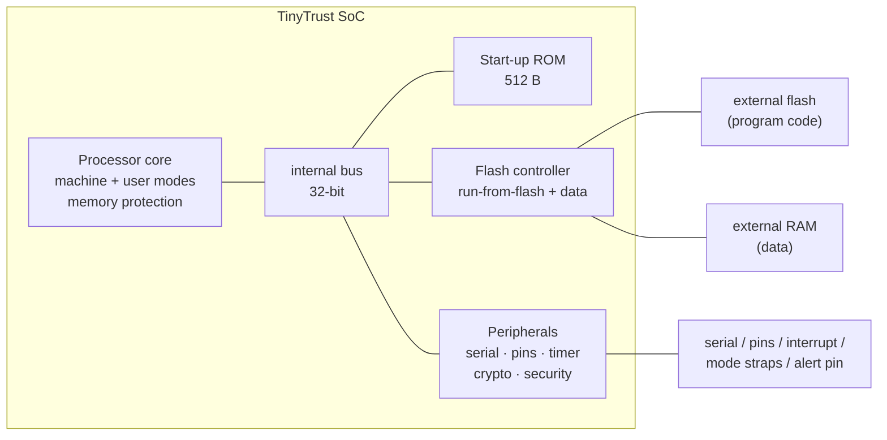

# Architecture Specification (version 1)

*Status: draft v0.1, 2026-07-14*
*Parent document: [REQUIREMENTS.md](REQUIREMENTS.md)*

> **Read this first.** This is the **original version 1 specification**, written
> when the target was a small shared-silicon shuttle with a strict area budget.
> Several decisions here were later reversed — the processor became a 5-stage
> pipeline, the register set went from 16 registers to 32, and the target
> changed to a full custom chip. Those reversals, and why they were made, are in
> [RETARGET.md](RETARGET.md); the current plan is in
> [TAPEOUT_PLAN.md](TAPEOUT_PLAN.md).
>
> It is kept as written, rather than quietly edited, because "here is what I
> optimised for, here is what changed, here is what that cost" is more useful
> than a specification pretending it was always right. Reversed items are marked
> where they appear.

---

## 1. Overview

TinyTrust version 1 is a small microcontroller system on a chip. One processor
core talks over a simple internal bus to start-up ROM, a controller for
external flash and RAM, and a block of peripherals (serial port, general
purpose pins, timer, crypto accelerator, and security status registers).

Everything runs from a single clock, and only the processor can start a
transfer on the bus — which keeps both the hardware and the proofs simple.



### Design principles, in priority order

1. **Area first.** Every block is judged by size. Shared hardware — one adder,
   one shifter, one bus — beats duplicated hardware.
2. **Ease of verification second.** Prefer structures that proofs and
   exhaustive testing can actually close: simple control logic, no guessing
   ahead, one transfer at a time.
3. **Speed a distant third.** Fetching an instruction from external flash costs
   roughly 10 to 20 cycles. Until that changes, optimising anything else is
   pointless.

*Both of the first two were later re-ordered — see RETARGET.md §1.*

---

## 2. Decision log

The reasoning behind each choice, including the ones later reversed.

| # | Decision | What we rejected | Why |
|---|---|---|---|
| D1 | **Processor handles one instruction at a time** (no pipeline) | A 2- or 3-stage pipeline | Fetching from external flash takes 10–20 cycles per instruction and dominates everything. A pipeline's extra throughput is wasted waiting for fetch, while its hazard logic, extra registers and larger proof surface all cost area. Handling one instruction at a time also allows heavy reuse — a single adder serves the program counter, branch targets, address calculation and arithmetic — and the timing is trivial to explain. **Reversed at P2**; the measured result is in RETARGET.md §9.2. |
| D2 | ~~**16 registers instead of 32**~~ **REVERSED 2026-08-16 → 32 registers** | The full 32-register set | *Original reasoning:* a 32 × 32-bit register file is about 1,024 storage elements, on its own bigger than the rest of the processor; halving it was the single largest saving available, and both major compilers support the reduced set. **Superseded by RETARGET.md D18**: the area argument only existed because of the small fixed tile budget, which no longer applies on a full chip. Using all 32 registers also removes an assumption from the proof setup. |
| D3 | **Register file built from flip-flops** | A latch-based register file | Latches roughly halve the area but complicate timing analysis, hold-time closure and the proof setup. Kept as the fallback if area ran out. |
| D4 | **No compressed instructions in v1** | Adding the compressed extension | Compressed instructions cut fetch traffic by around 30%, which is a real win when fetch is the bottleneck, but they cost an aligner and expander (roughly 0.8–1 kGE) and complicate proof timing. Revisit once real area numbers exist. |
| D5 | **Shifter that moves one bit per cycle** | A barrel shifter that shifts any distance in one cycle | A barrel shifter costs roughly 0.6–0.8 kGE. Up to 31 extra cycles per shift is invisible next to the fetch cost. **Reversed at P2**, and that reversal caused BUG-004. |
| D6 | **Memory protection: 4 regions, power-of-two sizes only, minimum 1 KB** | Full support for all region types | Arbitrary-range regions need a pair of comparators each; power-of-two regions need only a mask and a compare. This is a documented deviation from the specification, and a legal one, because the specification allows unsupported modes to read back as "off". |
| D7 | **Crypto accelerator does the permutation only; the modes are software** | Full hashing and encryption logic in hardware; using AES instead | Hardware does the expensive inner rounds. Firmware handles the surrounding sequence. One block then serves hashing, authentication and encryption. |
| D8 | **Expected firmware fingerprint built into the start-up ROM** | A separate signed manifest | The simplest possible root of trust. The demo firmware is fixed at manufacture, and arbitrary firmware can still be run using the development mode pin. A manifest scheme is a documented path for later. |
| D9 | **One trap entry point, no interrupt vector table** | Vectored interrupts | One entry point; dispatch in software. Saves an adder path and register bits. |
| D10 | **One bus transfer at a time** | Allowing transfers to overlap | Keeps the bus, the flash controller and the protection check trivially verifiable. **Kept** — the two-core bus makes the same choice for the same reason (D26). |

---

## 3. Clock, reset and pins

- **A single clock domain.** Target 40 MHz after layout. The flash clock runs
  at half the processor clock.
- **Reset** is synchronised through two flip-flops, and every storage element
  resets — cheap insurance for fault-injection claims and for simulating the
  final wired-up design.
- The processor starts at address `0x0000_0000`, the ROM, in machine mode.

### Pin map

*This map is for the version 1 shuttle form factor: 8 inputs, 8 outputs and 8
that can be either. The version 2 chip has its own pin plan.*

| Pin | Function | | Pin | Function |
|---|---|---|---|---|
| `ui[0]` | serial receive | | `uo[0]` | serial transmit |
| `ui[1]` | external interrupt | | `uo[1]` | **security alert** (boot failure or internal fault, sticky) |
| `ui[2]` | **development mode**: 1 = skip boot verification | | `uo[2]` | boot OK (firmware verified and running) |
| `ui[3]` | reserved | | `uo[3]` | trap indicator (for debugging) |
| `ui[7:4]` | general purpose in | | `uo[7:4]` | general purpose out |
| `uio[0]` | flash chip select | | `uio[4:1]` | flash data lines |
| `uio[5]` | flash clock | | `uio[6]` | external RAM chip select |
| `uio[7]` | spare / debug | | | |

The mode pins are sampled once, 8 cycles after reset is released, into a locked
register — so they cannot be flipped afterwards to get around a failed boot.

---

## 4. Memory map

Addresses are decoded on their top four bits only, which is cheap. Anything
unmapped causes an access-fault trap.

| Address | Size | What is there | Access |
|---|---|---|---|
| `0x0000_0000` | 512 B | Start-up ROM | read and execute; locks itself away before handing over |
| `0x1000_0000` | 16 MB | External flash, executed in place | read and execute; writes fault, since programming happens off-chip |
| `0x2000_0000` | 8 MB | External RAM | read, write and execute |
| `0x3000_0000` | 4 KB | Peripheral registers | read and write, machine mode by default |

### Peripheral registers (base `0x3000_0000`, all 32-bit)

| Offset | Block | Registers |
|---|---|---|
| `0x00` | Serial | `DATA` (write to send, read to receive), `STAT` (busy, data ready, overflow), `DIV` (speed divisor, 16-bit) |
| `0x10` | Pins | `OUT`, `IN` |
| `0x20` | Timer | `MTIME`, `MTIMECMP`, both 32-bit |
| `0x40` | Security | `STATUS` (boot stage, mode pin values, sticky fault flags — read only), `ALERT` (firmware can raise it; software can never clear it) |
| `0x80` | Crypto | `STATE0..9` (the 320-bit state, writable when idle), `CTRL` (start; round count 12, 8 or 6), `STAT` (busy) |
| `0xC0` | Flash | `CFG` (slow or fast mode, dummy cycle count), `DIRECT` (manual control, an escape hatch for bring-up) |

The timer registers are 32-bit rather than the specified 64-bit, so they wrap
after about 107 seconds at 40 MHz. This is a documented deviation. The cycle
and instruction counters are not implemented at all — **decided 2026-07-19: any
access to them traps as an illegal instruction**, which keeps open the option of
emulating them in software.

---

## 5. The processor

### 5.1 How instructions execute

One instruction finishes completely before the next is fetched:

```
        ┌────────────┐   ┌─────────┐   ┌──────────┐   ┌───────────┐
  ──────► FETCH      ├──►│ EXECUTE │──►│ MEMORY   │──►│ WRITE BACK│──┐
        │ (bus read) │   │ 1–32 cy │   │ (load /  │   │ 1 cy      │  │
        │ ~2–20 cy   │   │         │   │  store)  │   │           │  │
        └────────────┘   └─────────┘   └──────────┘   └───────────┘  │
              ▲                └─────── trap from any stage ─────┐   │
              └──────────────────────────────────────────────────┴───┘
```

- **Fetch:** read from the bus at the program counter, checked for execute
  permission. ROM takes 2 cycles; external flash takes about 10–20.
- **Execute:** decode and compute. One cycle for arithmetic, logic, comparison
  and resolving branches; 1 to 31 extra cycles for shifts (D5). The branch
  target and the next instruction address are computed on the *same shared
  adder* in successive cycles.
- **Memory:** loads and stores only, permission-checked. External RAM takes
  about 10–20 cycles, peripherals 2.
- **Write back:** update the register file and the program counter, 1 cycle.

Estimated 15 to 25 cycles per instruction when running from flash, which D1
accepts. Hot loops can be copied to external RAM or kept small.

> **Version 2 note (2026-08-30).** Everything in §5.1 and §5.2 describes
> `rtl/core/core.v`, the one-instruction-at-a-time processor, which is still
> built and still verified. It is no longer the processor version 2 carries
> forward. `rtl/core/core_p5.v` implements the same architecture as a 5-stage
> pipeline with separate instruction and data ports and a single-cycle shifter
> — see [RETARGET.md](RETARGET.md). The two share the register file and the
> protection unit, and are held to the same testing standard.

### 5.2 Datapath — share everything

- One 32-bit adder/subtractor, used for the next instruction address, branch
  and jump targets, load/store addresses, and add/subtract/compare.
- One logic unit, one shifter that reuses a shared shift register.
- Register file: 16 entries of 32 bits in flip-flops, one write port and two
  read ports built from multiplexers. Register `x0` is not stored at all, since
  it is always zero.
- No multiply or divide hardware. Those instructions trap, and firmware may
  emulate them.

### 5.3 Privilege levels

- Two modes only: **machine** and **user**.
- All traps go to machine mode, through a single entry point (D9).
- **Control registers implemented:** processor status (interrupt-enable and
  previous-mode fields only), trap vector base, saved program counter, trap
  cause (5 bits), trap value (**hardwired to 0** — a documented and legal
  deviation), a scratch register, interrupt enable and pending (timer and
  external only), the ISA description register (reads 0, which is legal), the
  four identification registers (read 0), and the memory protection registers.
- **Decisions made while writing the hardware (2026-07-19):** unimplemented
  control registers, including all counters, trap as illegal instructions;
  `FENCE` does nothing; `FENCE.I` traps, because there are no caches to flush;
  `WFI` does nothing, which the specification permits; writing an unsupported
  privilege value maps to user mode; the internal-fault trap in §5.5 uses cause
  `0x8000_0018` and does not report an instruction as completed.
- **Trap causes used:** instruction access fault (1), illegal instruction (2),
  breakpoint (3), load access fault (5), store access fault (7), system call
  from user (8), system call from machine (11), and misaligned instruction,
  load or store (0, 4, 6). Interrupts: timer (`0x8000_0007`) and external
  (`0x8000_000B`).
- No supervisor mode, no virtual memory, no debug module. Bring-up debugging is
  the serial port plus the trap indicator pin — a documented risk.

### 5.4 Memory protection

- 4 regions. The mode field accepts only "off" or "power-of-two sized", and the
  smallest region is 1 KB.
- The lock bit is fully supported: a locked region applies even to machine mode
  and cannot be changed until reset.
- Checking: in user mode, every fetch and data access must match a region that
  grants the needed permission. **No match in user mode is a fault**, which is
  the specified behaviour. Machine mode is unchecked except by locked regions.
- The matching itself is one AND and one comparison per region — no adders.
- The start-up ROM programs and **locks region 0 over itself with no
  permissions at all** before jumping to firmware. After boot, *nothing* can
  read or re-enter the ROM. This is both defence in depth and something that
  can be demonstrated on the bench.

### 5.5 Hardened control logic

- The processor's control states use encodings that differ from each other in
  at least two bits, so a single flipped bit cannot turn one valid state into
  another. An invalid state raises an internal fault signal.
- That signal sets a sticky bit in the security status register, drives the
  alert pin high, and forces a trap with a reserved cause. The bit and the pin
  clear only on a hardware reset.
- The mode pins and the privilege state are stored twice and compared, costing a
  few dozen storage elements. Budget cap: 300 gate equivalents, or it gets cut.

---

## 6. Internal bus

One master, one transfer outstanding at a time (D10):

```
processor → bus:  valid, address, write data, byte enables, is-this-a-fetch
bus → processor:  ready, read data, fault
```

The protection check sits between the processor and the address decoder, so a
denied access is **never presented** to its target. A denied write to a
peripheral therefore cannot have a side effect.

## 7. Flash controller

- Two chip selects — flash and external RAM — sharing the clock and data lines.
- **Flash:** fast four-bit reads using continuous-read mode, where the command
  is sent once and sequential fetches skip it entirely. That is the main lever
  on fetch latency. It can fall back to plain single-bit reads for maximum
  compatibility during bring-up.
- **External RAM:** four-bit reads and writes, one word per transfer, matching
  D10's simplicity.
- **Manual mode:** firmware, or a host over the serial port, can drive the
  flash pins directly. Reading the flash chip's ID on day one of bring-up must
  not depend on the run-from-flash path already working.

## 8. Crypto accelerator

- Implements the **Ascon permutation** only: a 320-bit state exposed as ten
  32-bit registers, one round per cycle, with 6, 8 or 12 rounds selectable.
- A round is a constant XOR, 64 parallel 5-bit substitution boxes, and a
  diffusion layer that is just fixed wiring and XORs. Estimated 3.5–4.5 kGE
  including the state storage, making it the single largest block. If area ran
  out, the fallback was to process the substitution boxes in slices — 16 per
  cycle, so 4 cycles per round, cutting the logic by about 40%.
- Software drives the full Ascon-Hash256 sequence: 64 bits absorbed per
  permutation, the initial value from NIST SP 800-232, and a 256-bit result.
- Hashing a 32 KB image is about 4,096 permutations, roughly 50,000 cycles of
  crypto time. Boot verification finishes well under 100 ms even with flash
  reads dominating.

## 9. Secure boot

```
reset → machine mode, running from ROM:
 1. Sample and lock the mode pins.            (8 cycles after reset)
 2. Set up the flash controller in slow mode, read the image header:
      magic number | image length | entry offset
 3. If development mode is set, skip to step 6 with a distinct blink pattern.
 4. Hash the image with Ascon-Hash256.
 5. Compare against the expected fingerprint stored in ROM (32 bytes):
      mismatch → raise the alert pin, record why, and spin forever.
      No retry, no bypass. Only a reset gets out.
 6. Lock the ROM away: region 0, no permissions, locked.
 7. Switch the flash to fast mode, signal boot OK,
    and jump to the firmware entry point.
```

- The ROM is hand-written assembly, target **512 bytes or less**. It holds no
  writable state beyond registers, and the hashing loop is its only data path.
- Because the ROM cannot be patched after manufacture, it gets its own
  verification standard: instruction-by-instruction comparison against a Python
  model of the whole flow, every branch and failure path exercised, and
  simulation of the final wired-up version. Treated as a milestone of its own.
- The demo firmware then sets up a user-mode region, drops to user mode, and
  runs a serial shell. An "attack me" command tries a user-mode access to the
  peripherals and gets a clean protection trap — a demonstration you can run on
  the bench.

## 10. Area budget v0.3 — measured 2026-07-14

Full method and data: [synth/calibration/REPORT.md](../synth/calibration/REPORT.md).
Real hardware for the four riskiest blocks, synthesised and priced with the
version 1 process, deliberately pessimistic by 10–30% against a real flow.

*Sizes are in kGE — thousands of "gate equivalents", where one unit is the area
of a basic logic gate. "Tiles" are the fixed unit the version 1 shuttle sold
area in.*

| Block | kGE | Tiles | First thing to cut |
|---|---|---|---|
| Crypto (one round per cycle) | **9.5 measured** | 4.06 | slice the substitution boxes (−1.5) |
| Register file (15 × 32 flip-flops) | **7.0 measured** | 2.97 | latch-based file (D3, −2) |
| Memory protection, 4 regions | **2.5 measured** | 1.08 | drop to 2 regions |
| Start-up ROM, 512 B | **2.2 measured** | 0.92 | shrink to 384 B |
| Processor control and datapath | 3.5–4.5 est. | ~1.7 | — |
| Control register file | 1.5–2.0 est. | ~0.75 | fewer writable fields |
| Flash controller | 1.2–1.8 est. | ~0.65 | drop fast external RAM |
| Serial, pins, timer, security | 0.8–1.2 est. | ~0.4 | fix the baud rate |
| Glue and fault hardening | 0.6–0.9 est. | ~0.3 | cut the hardening |
| **Total (pessimistic)** | **29–32 kGE** | **12–13.5** | |
| **Total (expected, real flow −20%)** | **23–26 kGE** | **~10–11** | |

**Plan of record: 16 tiles (about €1,120) — signed off 2026-07-14.** Properly
mapped areas came in 26% below the pessimistic table: the measured four-block
subtotal was 15.6 kGE, about 6.65 tiles, projecting a full system at 9–10
tiles. So 16 tiles carried about 60% headroom, and dropping to 12 was a
realistic option to revisit later. The original hope of 8 tiles was never
realistic.

*All of this was superseded on 2026-08-16 by the move to a full custom chip.*

## 11. Testability designed in from the start

- The bus has exactly one transfer shape, so a single assertion covers every
  access. "A denied access has no side effect" is an assertion, not a
  convention.
- The control logic uses checkable state encodings, so its invariant is two
  lines.
- The crypto block has official published test vectors, so the scoreboard has a
  reference to check against directly.
- The security status register exposes the boot stage and fault flags, so
  debugging a real chip does not depend on the serial port working.
- Every documented deviation above gets a directed test proving the
  *restricted* behaviour — so a deviation is a verified choice rather than a
  surprise.

## 12. Open items from version 1

1. ~~Should the cycle counters read zero or trap?~~ — **decided: trap**
   (§5.3, 2026-07-19).
2. Compressed instructions, yes or no — decide with real area and speed data.
3. External RAM part selection, which affects the command set.
4. The expected-fingerprint build step: the ROM image has to be regenerated
   from the firmware hash as the last step before submission, and needs a build
   guard so a stale fingerprint cannot be manufactured.
