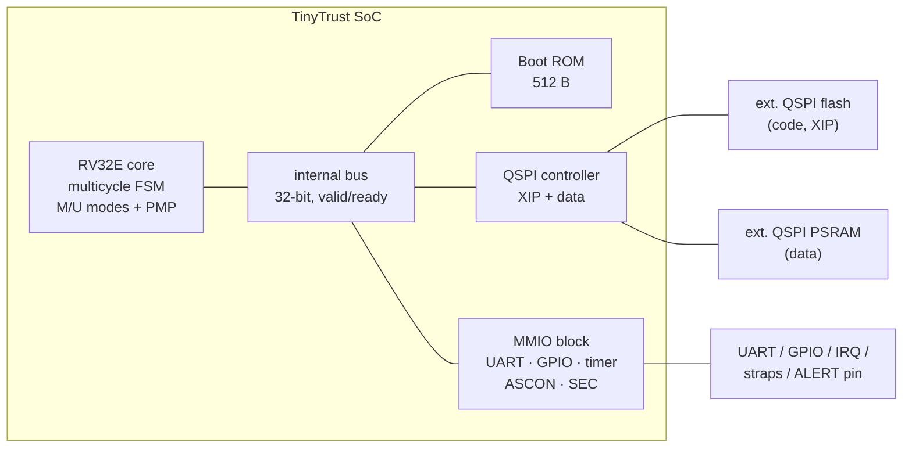

# TinyTrust — Architecture Specification

*Status: DRAFT v0.1 for review — 2026-07-14*
*Parent document: [REQUIREMENTS.md](REQUIREMENTS.md)*

---

## 1. Overview

TinyTrust is a single-master, single-clock-domain RV32E microcontroller SoC.
One multicycle CPU core talks over a simple internal bus to a boot ROM, a QSPI
XIP controller (external flash + PSRAM), and a small MMIO peripheral block
(UART, GPIO, timer, ASCON accelerator, security/status registers).



### Design principles (in priority order)

1. **Area first.** Every block is judged in gate-equivalents. Shared hardware
   (one adder, one shifter, one bus) beats duplicated hardware.
2. **Verifiability second.** Prefer structures riscv-formal and exhaustive
   testing can close: simple FSMs, no speculation, one transaction in flight.
3. **Performance a distant third.** Fetch from QSPI flash costs ~10–20 cycles
   per 32-bit word; nothing else is worth optimizing until that is.

---

## 2. Decision log (the "why" — interview-facing)

| # | Decision | Alternatives rejected | Rationale |
|---|---|---|---|
| D1 | **Multicycle (non-pipelined) core** | 2-stage / 3-stage pipeline | XIP fetch latency (~10–20 cycles/word) dominates CPI; a pipeline's throughput is wasted stalling on fetch while its hazard logic, pipeline registers, and verification surface all cost area. Multicycle allows radical HW reuse (one adder for PC+4 / branch target / AGU / ALU) and has trivially explainable timing. |
| D2 | **RV32E** (16 registers) | RV32I | 32×32 DFF register file ≈ 1,024 flops — alone larger than the rest of the core. RV32E halves it. GCC/LLVM both support the `rv32e`/ilp32e ABI. |
| D3 | **DFF register file** (v1) | SKY130 latch-based file | Latch file ~halves regfile area but complicates STA, hold closure, and formal setup. Kept as the designated fallback if the trim ladder is exhausted. |
| D4 | **No C extension in v1** (stretch goal, decide at M1 with data) | RV32EC | C cuts fetch traffic ~30 % (real win given XIP), but costs an aligner + expander (~0.8–1 kGE) and complicates riscv-formal timing. Revisit once calibrated synthesis numbers exist. |
| D5 | **Iterative 1-bit/cycle shifter** | 32-bit barrel shifter | Barrel ≈ 0.6–0.8 kGE. Worst-case 31 extra cycles per shift is invisible next to fetch cost. |
| D6 | **PMP: 4 entries, NAPOT + OFF only, ≥ 1 KiB grain** | Full TOR/NA4 support | TOR needs a ≥ comparator pair per entry; NAPOT needs only a mask-and-compare. Documented spec deviation: `pmpcfg.A` is WARL and TOR/NA4 write as OFF (WARL makes this legal). |
| D7 | **ASCON permutation as MMIO coprocessor, mode logic in software** | Full AEAD/hash FSM in HW; AES | Hardware does only the permutation rounds (the expensive part); ROM/firmware sequences absorb/squeeze. One block serves hash, MAC, and AEAD. |
| D8 | **Golden digest baked into boot ROM (v1)** | Manifest sector w/ digest-of-digest | Simplest possible root of trust; demo firmware is fixed at tape-out, arbitrary firmware runs via the dev strap. A manifest scheme is a documented v2 path. |
| D9 | **mtvec direct mode only, WARL-fixed base** | Vectored interrupts | One trap entry point; vectoring in software. Saves an adder path and CSR bits. |
| D10 | **Single outstanding bus transaction** | Any overlap | One-in-flight valid/ready keeps the bus, QSPI, and PMP check trivially verifiable. |

---

## 3. Clocking, reset, and pinout

- **One clock domain**, from the TT `clk` input. Target: 40 MHz post-layout
  (TT board clock is configurable; QSPI SCK = clk/2).
- **Reset**: TT `rst_n`, synchronized to two-flop; all state resets (no
  reset-less flops — cheap insurance for fault-injection claims and GL sim).
- Core boots at `PC = 0x0000_0000` (ROM base) in M-mode.

### Pin map (TT: 8 in / 8 out / 8 bidir)

| Pin | Function | | Pin | Function |
|---|---|---|---|---|
| `ui[0]` | UART RX | | `uo[0]` | UART TX |
| `ui[1]` | external IRQ | | `uo[1]` | **SEC_ALERT** (boot-fail / FSM-fault, sticky) |
| `ui[2]` | **DEV strap**: 1 = skip boot verification (dev mode) | | `uo[2]` | BOOT_OK (firmware verified & running) |
| `ui[3]` | reserved strap | | `uo[3]` | trap-active indicator (debug) |
| `ui[7:4]` | GPIO in | | `uo[7:4]` | GPIO out |
| `uio[0]` | QSPI flash CS_n | | `uio[4:1]` | QSPI SD[3:0] |
| `uio[5]` | QSPI SCK | | `uio[6]` | QSPI PSRAM CS_n |
| `uio[7]` | spare / debug strobe | | | |

Straps are sampled once, 8 cycles after reset deassertion, into a locked
register (they cannot be toggled later to bypass a failed boot).

---

## 4. Memory map

Decode uses `addr[31:28]` only (cheap). Unmapped access → access-fault trap.

| Base | Size | Region | Access |
|---|---|---|---|
| `0x0000_0000` | 512 B | Boot ROM | RX (M-mode; self-locked via PMP before handoff) |
| `0x1000_0000` | 16 MiB | QSPI flash, XIP | RX (writes fault; flash programming is off-chip) |
| `0x2000_0000` | 8 MiB | QSPI PSRAM | RWX |
| `0x3000_0000` | 4 KiB | MMIO peripherals | RW, M-mode by default (PMP-controlled) |

### MMIO register map (base `0x3000_0000`, all 32-bit)

| Offset | Block | Registers |
|---|---|---|
| `0x00` | UART | `DATA` (RW, TX write / RX read), `STAT` (TX busy, RX valid, overflow), `DIV` (baud divisor, 16-bit) |
| `0x10` | GPIO | `OUT`, `IN` |
| `0x20` | TIMER | `MTIME` (RW, 32-bit), `MTIMECMP` (RW, 32-bit) |
| `0x40` | SEC | `STATUS` (RO: boot state, strap values, fault-FSM sticky flags), `ALERT` (W1S: firmware may assert alert; never clearable by software) |
| `0x80` | ASCON | `STATE0..9` (RW when idle: 320-bit state), `CTRL` (W: start; `ROUNDS` = 12/8/6), `STAT` (RO: busy) |
| `0xC0` | QSPI | `CFG` (mode: 1-bit SPI vs quad; dummy-cycle count), `DIRECT` (bit-bang escape hatch for flash ID/programming during bring-up) |

`MTIME`/`MTIMECMP` are 32-bit (wraps in ~107 s at 40 MHz) — documented
deviation from the 64-bit spec counters; `mcycle`/`minstret` are not
implemented (reads trap → emulable, or read-as-zero; final choice at RTL time,
recorded here when made).

---

## 5. CPU core

### 5.1 Execution model

Multicycle FSM, one instruction fully retires before the next fetch:

```
        ┌────────────┐   ┌─────────┐   ┌──────────┐   ┌───────────┐
  ──────► FETCH      ├──►│ EXECUTE │──►│ MEM      │──►│ WRITEBACK │──┐
        │ (bus read) │   │ 1–32 cy │   │ (ld/st   │   │ 1 cy      │  │
        │ ~2–20 cy   │   │         │   │  only)   │   │           │  │
        └────────────┘   └─────────┘   └──────────┘   └───────────┘  │
              ▲                └─────── TRAP entry (any stage) ──┐   │
              └──────────────────────────────────────────────────┴───┘
```

- **FETCH**: bus read at PC. PMP-checked (execute permission). ROM: 2 cycles;
  flash XIP: ~10–20 cycles (QSPI quad mode, continuous-read).
- **EXECUTE**: decode + ALU op. 1 cycle for add/sub/logic/compare/branch
  resolve; 1–31 extra for shifts (D5). Branch target and PC+4 computed on the
  *same shared adder* in successive cycles.
- **MEM**: loads/stores only; PMP-checked; PSRAM ~10–20 cycles, MMIO 2 cycles.
- **WRITEBACK**: regfile write + PC update, 1 cycle.

Estimated CPI ≈ 15–25 executing from flash — acceptable per D1; hot loops can
be copied to PSRAM (still external) or kept tiny.

### 5.2 Datapath (shared-everything)

- One 32-bit adder/subtractor: PC+4, branch/jump target, effective address,
  ADD/SUB/SLT (compare via subtract flags).
- One logic unit (AND/OR/XOR), one iterative shifter (shared shift register).
- Register file 16 × 32 DFF, 1W port, 2R via muxes; `x0` not stored.
- No multiplier/divider (no M extension — `mul`/`div` trap to M-mode where
  firmware may emulate).

### 5.3 Privilege architecture

- Modes: **M** and **U** only (`mstatus.MPP` is WARL over {00, 11}).
- Traps: all to M-mode, `mtvec` direct (D9).
- **Implemented CSRs**: `mstatus` (MIE, MPIE, MPP only), `mtvec` (WARL,
  16-byte-aligned base, mode bits fixed 0), `mepc`, `mcause` (5 bits),
  `mtval` (**hardwired 0** — documented deviation, legal per spec),
  `mscratch`, `mie`/`mip` (MTIE/MTIP, MEIE/MEIP only), `misa` (read 0 —
  legal), `mvendorid/marchid/mimpid/mhartid` (read 0),
  `pmpcfg0`, `pmpaddr0..3`.
- **Exception causes used**: instruction access fault (1), illegal
  instruction (2), breakpoint (3), load access fault (5), store access
  fault (7), ecall-from-U (8), ecall-from-M (11), misaligned
  instr/load/store (0/4/6). Interrupts: machine timer (0x8000_0007),
  machine external (0x8000_000B).
- No S-mode, no MMU, no debug module (bring-up debug = UART + trap
  indicator pin; documented risk).

### 5.4 PMP (lean, per D6)

- 4 entries: `pmpaddr0..3` + `pmpcfg0`. `A` field WARL ∈ {OFF, NAPOT};
  grain G = 8 (min region 1 KiB → `pmpaddr[7:0]` effectively fixed).
- `L` (lock) bit fully supported: locked entries apply to M-mode and are
  immutable until reset.
- Check: fetch and data accesses in U-mode must match an entry with the
  needed permission; **no match in U-mode = fault** (spec behavior). M-mode
  is unchecked except by locked entries.
- Matching logic: per entry, NAPOT decode to (base, mask), then
  `(addr & ~mask) == base` — one AND + compare per entry, no adders.
- Boot ROM programs and **locks entry 0 over the ROM region with R=W=X=0**
  before jumping to firmware — post-boot, *nothing* can re-enter or read the
  ROM (defense-in-depth and a demo-able property).

### 5.5 Fault-hardened control (per requirements §4.5)

- The core FSM and boot sequencer states use encodings with pairwise Hamming
  distance ≥ 2; an invalid state or parity violation asserts `fsm_fault`.
- `fsm_fault` → sticky bit in `SEC.STATUS`, `SEC_ALERT` pin high, and a
  forced trap to `mtvec` with a reserved cause; the sticky bit and pin clear
  only on hardware reset.
- Straps and `mstatus.MPP`-adjacent privilege state are duplicated-and-
  compared (a few dozen flops). Budget cap: 300 GE total or it's trimmed.

---

## 6. Internal bus

Single-master valid/ready, one transaction outstanding (D10):

```
cpu → bus:  valid, addr[31:0], wdata[31:0], wstrb[3:0], is_fetch
bus → cpu:  ready, rdata[31:0], fault        (fault = PMP or decode error)
```

PMP check sits between core and decode: a faulting access is **never
presented** to the target (no side effects on MMIO from denied accesses).

## 7. QSPI controller

- Two chip-selects (flash, PSRAM) sharing SCK/SD[3:0].
- **Flash**: quad fast-read with continuous-read mode (command sent once;
  sequential fetches skip the command phase — the main XIP latency lever).
  Falls back to 1-bit SPI read (`0x03`) via `QSPI.CFG` for maximum bring-up
  compatibility.
- **PSRAM**: quad read/write, linear-burst off (one word per transaction —
  simplicity per D10).
- `QSPI.DIRECT` bit-bang mode: firmware (or the bring-up host over UART)
  can drive CS/SCK/SD directly — reading flash JEDEC ID on day one of
  bring-up must not depend on the XIP path working.

## 8. ASCON accelerator

- Implements **Ascon-p** only: 320-bit state (10 × 32-bit MMIO regs), one
  round per cycle, `ROUNDS` ∈ {6, 8, 12}; `busy` for that many cycles.
- Round = round-constant XOR + 64 parallel 5-bit S-boxes + linear diffusion
  (fixed rotations = wiring + XORs). Estimated 3.5–4.5 kGE incl. state flops
  — the single biggest block; if calibration synthesis overflows, fallback is
  slice-serial S-boxes (16/cycle → 4 cycles/round, ~40 % logic reduction).
- Software (ROM asm now, firmware later) sequences Ascon-Hash256: absorb
  rate = 64 bits/permutation, IV per NIST SP 800-232, squeeze 256-bit digest.
- Hashing a 32 KiB image ≈ 4096 permutations ≈ 50 k cycles of ASCON time —
  boot verification completes in well under 100 ms even with QSPI reads
  dominating.

## 9. Secure boot flow

```
reset → M-mode @ ROM:
 1. Sample & lock straps.               (8 cycles post-reset)
 2. Init QSPI (SPI mode), read image header @ 0x1000_0000:
      magic | image_length | entry_offset
 3. If DEV strap set → skip to step 6 with BOOT_OK=0 pattern (blink code).
 4. Hash image_length bytes with ASCON-Hash256.
 5. Compare to GOLDEN_DIGEST (32 B constant in ROM):
      mismatch → SEC_ALERT=1, record cause in SEC.STATUS, spin in WFI loop.
      (No retry, no bypass — only reset exits.)
 6. Program PMP: entry0 = ROM region, no perms, LOCKED.
 7. Switch QSPI to quad/continuous mode, BOOT_OK=1,
    jump to 0x1000_0000 + entry_offset (M-mode).
```

- ROM is hand-written assembly, target **≤ 512 B**; it contains no
  writable state beyond registers; the digest loop is the only data path.
- ROM verification bar (it is unpatchable): instruction-accurate co-sim
  against a Python golden model of the whole flow, plus every branch/fault
  path exercised, plus GL sim. Treated as its own DV milestone.
- Demo firmware then: programs PMP for a U-mode region, drops to U-mode via
  `mret`, runs a UART shell; a "attack me" shell command attempts U-mode
  access to MMIO → clean PMP trap → demo on the bench.

## 10. Area budget v0.3 — MEASURED (calibration synthesis, 2026-07-14)

Full method and data: [synth/calibration/REPORT.md](../synth/calibration/REPORT.md).
Real RTL for the four riskiest blocks, Yosys generic-mapped and priced with
SKY130 HD cell areas (pessimistic by 10–30 % vs. a real ABC/OpenLane flow):

| Block | Measured/est. kGE | Tiles | First trim action |
|---|---|---|---|
| ASCON (round/cycle) | **9.5 measured** | 4.06 | slice-serial S-boxes (−~1.5) |
| Regfile (15×32 DFF) | **7.0 measured** | 2.97 | latch-based file (D3, −~2) |
| PMP ×4 | **2.5 measured** | 1.08 | 4 → 2 entries |
| Boot ROM 512 B (stub) | **2.2 measured** | 0.92 | shrink to 384 B |
| Core control + datapath | 3.5–4.5 est. | ~1.7 | — |
| CSR file | 1.5–2.0 est. | ~0.75 | shrink WARL surface |
| QSPI | 1.2–1.8 est. | ~0.65 | drop PSRAM quad |
| UART+GPIO+timer+SEC | 0.8–1.2 est. | ~0.4 | fixed baud |
| Glue + fault hardening | 0.6–0.9 est. | ~0.3 | cut hardening |
| **Total (pessimistic)** | **29–32 kGE** | **12–13.5** | |
| **Total (expected, real flow −20 %)** | **23–26 kGE** | **~10–11** | |

**Plan of record: 4×4 = 16 tiles (~€1,120) — SIGNED OFF by user 2026-07-14.**
True ABC-mapped areas (see REPORT.md addendum) came in 26 % below the
pessimistic table: measured four-block subtotal 15.6 kGE / 6.65 tiles,
projected full SoC ~9–10 tiles. 16 tiles therefore carries ~60 % headroom;
a down-size to 4×3 = 12 tiles is a realistic decision to revisit at M1 with
full core RTL on the actual TT hardening flow (tile count only commits at
submission). The original 4×2 hope remains unrealistic.

## 11. Verification hooks designed in (DV starts at the spec)

- Bus has exactly one transaction shape → one SVA checker covers every master
  access; PMP-deny-has-no-side-effect is an assertion, not a convention.
- Core FSM one-hot-with-parity → riscv-formal + a two-line invariant.
- ASCON has a canonical reference (NIST KATs) → UVM scoreboard plugs into
  published test vectors directly.
- `SEC.STATUS` exposes boot-stage + fault flags → silicon debug does not
  depend on UART working.
- Every "documented deviation" above (WARL restrictions, `mtval`=0, 32-bit
  timer, NAPOT-only) gets a directed test proving the *restricted* behavior,
  so deviations are verified choices rather than surprises.

## 12. Open items (tracked, non-blocking)

1. `mcycle` read-as-zero vs. trap-and-emulate — decide at RTL.
2. C extension go/no-go — decide at M1 with calibrated area + XIP CPI data.
3. PSRAM part selection (affects quad command set) — pick the TT-community-
   proven part used by tinyQV-family boards.
4. GOLDEN_DIGEST build flow: ROM image must be regenerated from the demo
   firmware hash as the last pre-submission step — needs a Makefile guard so
   a stale digest can't be taped out.
