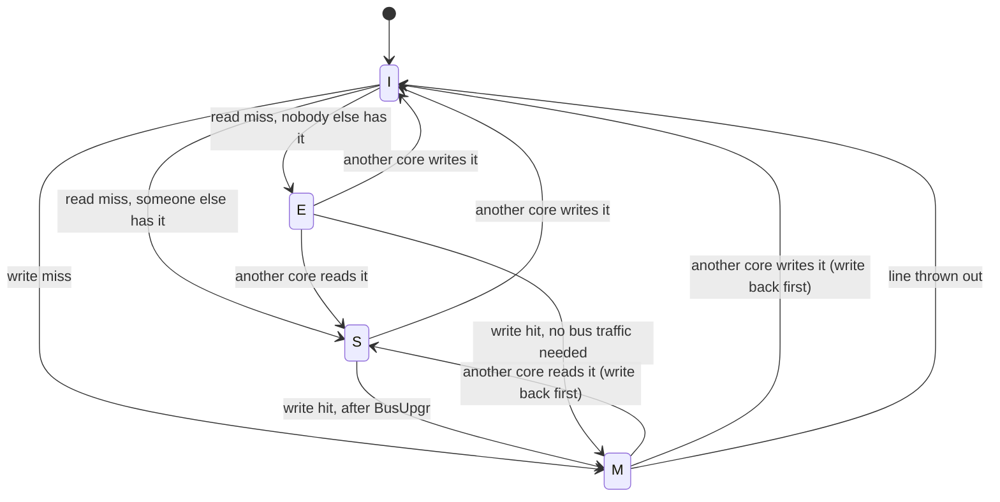

# Two-Core Memory Design (S2)

*Status: design started 2026-09-03. Builds the two-core part of the plan in
[TAPEOUT_PLAN.md](TAPEOUT_PLAN.md). Earlier decisions this builds on: D14 (two
cores), D15 (snooping), D16 (one design with a switch), D21 (cache size and
shape), D22 (where the proofs stop).*

---

## 1. The problem this solves

When two processor cores each have their own cache, they can each hold a copy
of the same piece of memory. If one core changes its copy, the other is now
holding stale data and does not know it. Left alone, the two cores disagree
about what memory contains, and programs break in ways that are very hard to
debug.

Keeping the copies in agreement is called **cache coherence**. The usual
solution on a small system is **snooping**: all the caches share one bus, and
each cache watches — "snoops" — every request the others make. If another core
asks for a line you are holding, you react: hand it over, mark yours as shared,
or throw yours away.

**MESI** and **MOESI** are two standard sets of rules for doing this. The names
are the states a cache line can be in:

| | |
|---|---|
| **M** — Modified | I have it, I changed it, memory is out of date, nobody else has it |
| **O** — Owned *(MOESI only)* | I have it, it is changed, others may have copies, I am responsible for it |
| **E** — Exclusive | I have it, unchanged, nobody else has a copy |
| **S** — Shared | I have it, unchanged, others may have it too |
| **I** — Invalid | I do not have it |

## 2. What we are actually building

D16 already settled the goal: **not a coherence protocol, but a comparison of
two.** One setting, `COHERENCE = MESI` or `MOESI`, picks between them in the
same design driven by the same test programs. Then we measure how much memory
traffic each causes, and how long shared data takes to reach the other core.

That decides every design question where there is a choice: anything that would
turn the two protocols into structurally different hardware is the wrong
answer, because it ruins the comparison.

---

## 3. Two things we thought we needed, and do not

Both came out of reading what the existing cache already does.

### 3.1 We do not need a second copy of the cache tags

Every cache keeps a "tag" for each line, recording which address that line
holds. The core reads the tags constantly. Once snooping is added, the snoop
logic needs to read them too — and if both want to read in the same cycle, they
collide.

The standard fix is a **second copy of all the tags**, one per reader. D21
assumed we would need this and budgeted the area: "before P4 duplicates the D$
tags for snooping".

We do not need it. That fix exists because tags usually live in an SRAM block,
and an SRAM block has a fixed, small number of ports. Our tags are not in SRAM.
D19 put them in ordinary flip-flops, and only the *data* array is an SRAM
block:

```verilog
    // Tag array (flops, D19)
    reg [TAG_BITS-1:0] tag_q   [0:LINES-1];
    reg                valid_q [0:LINES-1];
    reg                dirty_q [0:LINES-1];
```

A block of flip-flops can be read from as many places as you build wiring for.
So adding a snoop read costs a handful of gates rather than a second copy of
1,344 flip-flops — about **9.1 kGE saved per data cache**, and one fewer thing
that can go wrong, since two copies of the same information can drift apart.

What still needs sorting out is *writing* the tags. A snoop that invalidates a
line and a core access that fills one must not write the same entry in the same
cycle. That is a much cheaper problem — see §5.3.

### 3.2 MESI needs no extra storage at all

Each cache line already stores two flags: `valid` (do I have this line?) and
`dirty` (have I changed it?). That is two bits. MESI has four states, which
also fits in two bits:

| what we store today | MESI state |
|---|---|
| not valid | **I** |
| valid, not dirty | **S** or **E** — the only new distinction |
| valid, dirty | **M** |

So the entire cost of MESI in the tag array is being able to tell **S** from
**E**. Replacing the two flags with one 2-bit state is a rename, not growth.

**MOESI is not free the same way.** M, O, E, S, I is five states, which does
not fit in two bits, so it needs a third bit: 64 extra flip-flops per data
cache at our current size, about 0.43 kGE each, 0.86 kGE for both. Tiny next to
the 20.68 kGE the data memory block costs, but real — and the S2 area budget
should carry it rather than assume MESI's "free" carries over.

**Measured after the change landed, 2026-09-03**, using the same scripts as the
earlier area table:

| | flip-flops before | after | area before | area after |
|---|---|---|---|---|
| Instruction cache | 1,529 | **1,529** | 120,619 µm² | 120,751 µm² (+0.11%) |
| Data cache | 1,530 | **1,530** | 124,168 µm² | 123,351 µm² (−0.66%) |

Identical flip-flop counts, as predicted. The small area movements are ordinary
variation in the surrounding logic — and the data cache came out slightly
*smaller*, because comparing one 2-bit value is simpler than reading two
separate flags and combining them.

---

## 4. Decisions

| # | Decision | What else we considered | Why |
|---|---|---|---|
| **D23** | **No second copy of the tags.** Snooping reads the existing tag flip-flops through added wiring, with the two writers arbitrated. | Duplicate tags, as D21 assumed; dual-port SRAM tags | §3.1. Duplication solves an SRAM port conflict this design does not have. Saves about 9.1 kGE per data cache, and removes the risk of two copies disagreeing. |
| **D24** | **The coherence state replaces `valid` and `dirty`** rather than sitting beside them, as one 2-bit value. | A separate coherence-state array alongside the existing flags | §3.2. Same storage, and it makes "the state is the one true record for this line" a fact about the hardware rather than a rule to maintain. Keeping both would allow nonsense combinations like "not valid, but modified", which then have to be proven impossible. |
| **D25** | **The instruction cache stays out of the coherence system.** Only data caches snoop and are snooped. | Have the instruction cache participate too | The processor already refuses the `FENCE.I` instruction, so programs that modify their own code are not supported. Instruction memory therefore never changes while running, and an out-of-date instruction cache cannot be observed. This halves the snooping logic and the number of situations to prove. It is a genuine limitation — a program writing code for the other core is outside what this chip supports — and it is written down rather than hidden. |
| **D26** | **One request on the bus at a time, with a round-robin arbiter.** | A bus handling several overlapping requests, with miss-tracking registers | It is the shape the caches already speak: the existing memory port handles one request at a time. Overlapping requests are the more interesting engineering problem, but they multiply the situations to get right, and concurrent requests for the *same* line are exactly where coherence bugs live. The project already lists two-core verification as its least predictable estimate. Both protocols see the same bus either way, so the comparison stays fair. |

---

## 5. How the protocol works

### 5.1 Bus requests

These extend the cache's existing memory interface rather than replacing it, so
the uncached and error paths do not change.

| request | sent when | what the other cache does |
|---|---|---|
| `BusRd` | read miss | M → write it back, then S; E or S → S |
| `BusRdX` | write miss | M → write it back, then I; E or S → I |
| `BusUpgr` | writing to a line held as shared | E or S → I. No data moves. This is the request MOESI changes |
| `BusWB` | throwing out a modified line | nothing — it only goes to memory |

The snooping cache answers immediately with two signals: `snoop_shared` ("I
have this line, unchanged") and `snoop_dirty` ("I have it and I changed it").

**The one real difference between the protocols.** Under MESI, a cache snooped
while holding modified data must write that data back to memory, and the
requester then reads it from memory. Under MOESI, the holder keeps the line in
the **O** state and passes it straight to the other cache, with no memory write
at all. Counting the memory writes MOESI avoids is exactly the measurement S2
exists to produce.

### 5.2 State changes at the requesting core



**The E state is why MESI beats the simpler MSI protocol.** A read miss where
nobody else holds the line lands in **E**, and a later write then goes straight
to **M** with no bus traffic at all. On two cores running mostly private data,
that is the common case.

### 5.3 Who wins when both want to write a tag

Both the core and the snoop logic can want to change a tag entry in the same
cycle. **The snoop wins.**

By the time the tag write happens, this cache has already answered "shared" or
"modified" on the bus. Delaying our own update would leave the two caches
briefly disagreeing about that line — exactly what the whole design exists to
prevent. So the core's access waits one cycle instead, which the cache already
knows how to do. The cost is a rare one-cycle stall. The benefit is that the
caches are never, even briefly, out of step.

---

## 6. How it gets verified

D22 put the formal proof boundary at the processor's edge and gave the cache
its own separate property. S2 extends that arrangement rather than replacing
it.

**What has to be proven:**

| ID | Property |
|---|---|
| COH-INV-01 | For any address, either exactly one cache holds it as modified, or none does. Never two writers at once. |
| COH-INV-02 | A line held as shared or exclusive in one cache is never modified in the other. |
| COH-INV-03 | A read returns the value of the most recent write by *either* core. This is the existing single-cache property extended to two caches, and it is the point of the whole milestone. |
| COH-INV-04 | No sequence of requests can leave a line in a state that is not in the table above. |

**Directed tests** (`dv/coherence`): the standard shapes that catch coherence
bugs — store buffering, message passing, repeated reads of one location — plus
the cache-to-cache transfer that separates MOESI from MESI. These are cheap to
write once the bus exists.

### The scheduling problem inherited from P3

The single-cache version of COH-INV-03 **already does not finish** with the
bounded proof method. It needs to look 28 cycles ahead, and each extra cycle
costs about four times the last (see RETARGET.md §10.5). COH-INV-03 is a
strictly harder version of that same property across two caches, so **it will
not finish either**, and S2 should not spend days rediscovering that.

So the better proof technique P3 postponed is not optional here. It is the
critical path, and it should be built **before** the protocol hardware is
finished, so the properties can be developed against a method that can actually
evaluate them. That is the single most important consequence of P3's result for
this milestone.

---

## 7. Still to decide

1. **Does the arbiter have to be strictly fair, or just never starve anyone?**
   Round-robin is assumed. Worth writing a test that would deadlock under an
   unfair arbiter before settling this.
2. **Where does the write-back buffer live** — one per cache, or one shared in
   the bus? Shared is smaller; per-cache keeps the caches independent, which
   matters for splitting up the proofs.
3. **MOESI's owned-to-modified step on a local write** needs a `BusUpgr` while
   the line is already dirty. Worth confirming against the comparison before
   fixing the encoding, since it is the one transition with no MESI equivalent.
