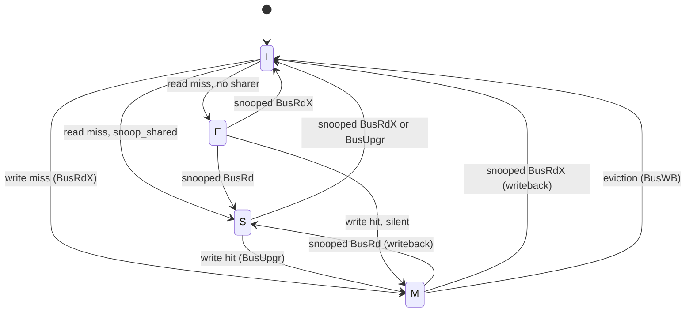

# TinyTrust P4/P5 — Coherence Design

*Status: DESIGN, opened 2026-09-03. Implements milestone P4 of
[RETARGET.md](RETARGET.md) §7; P5 extends the same RTL to MOESI.*
*Parent decisions: D14 (2 cores), D15 (snooping), D16 (one parameterizable
controller), D21 (cache geometry), D22 (formal boundary).*

---

## 1. What this milestone is for

D16 fixed the deliverable: **not a coherence protocol, but a comparison of
two.** `COHERENCE = MESI | MOESI` selects between them on identical RTL
driven by identical stimulus, so writeback traffic and shared-line latency
can be measured rather than argued. P4 builds the machinery and closes MESI;
P5 turns on the O state and produces the comparison.

That framing decides the architecture everywhere it is ambiguous: anything
that would make the two protocols structurally different RTL is the wrong
answer, because it destroys the controlled comparison.

---

## 2. What P3 already gives us

Two properties of the existing `rtl/cache/cache.v` turned out to matter more
than expected, and both **remove** planned P4 work.

### 2.1 The tags are flops, so snooping needs no duplicate tag array

D21 budgeted for this explicitly — it sized the tag flops "before P4
duplicates the D$ tags for snooping." That duplication is not needed here.

Tag duplication exists to solve a *port conflict*: when tags live in a
single-ported SRAM, a snoop lookup and a core lookup in the same cycle
contend, and the standard fix is a second physical copy. In this design only
the **data** array is a macro. D19 put the tag array in flops:

```verilog
    // Tag array (flops, D19)
    reg [TAG_BITS-1:0] tag_q   [0:LINES-1];
    reg                valid_q [0:LINES-1];
    reg                dirty_q [0:LINES-1];
```

A flop array has as many combinational read ports as you build muxes for. The
snoop path therefore costs a second index mux and comparator — tens of gates —
not a second copy of 1,344 flops (~9.1 kGE). **The area D21 reserved for tag
duplication is not needed.**

What *does* still need arbitration is tag **writes**: a snoop that
downgrades a line and a core access that fills one must not write the same
entry in the same cycle. That is a conflict between two writers, resolved by
priority (§5.3), and it is much cheaper than duplication.

### 2.2 MESI costs zero extra tag state

The D$ already stores two bits per line, `valid_q` and `dirty_q`, encoding
three reachable conditions. MESI has four states — also two bits:

| current encoding | MESI state |
|---|---|
| `!valid` | **I** — invalid |
| `valid && !dirty` | **S** or **E** — this is the split MESI adds |
| `valid && dirty` | **M** — modified |

So the entire cost of **MESI** in the tag array is *distinguishing E from S*,
which the existing two bits already have room to express. Re-encoding
`{valid, dirty}` as a 2-bit `state_q` is a rename, not a growth.

**MOESI is not free, and the difference is one bit.** M, O, E, S, I is five
states, so P5 needs a third bit per line: +64 flops per D$ at the D21 geometry
(64 lines), about 0.43 kGE each, 0.86 kGE across both. Negligible against the
20.68 kGE the data macro costs, but it is a real increment and the P5 area
line should carry it rather than inherit MESI's "free" by assumption.

This is worth stating because it inverts the intuition that coherence is
expensive in the tag array. MESI here is free; MOESI is one bit per line; the
cost of both lands in control logic and in the bus, not in tag state.

**Measured, 2026-09-03**, after the re-encode landed — sg13g2, same scripts as
the P3 area table (RETARGET.md §10.4):

| | flops before | flops after | area before µm² | area after µm² |
|---|---|---|---|---|
| `cache` I$ | 1,529 | **1,529** | 120,619 | 120,751 (+0.11%) |
| `cache` D$ | 1,530 | **1,530** | 124,168 | 123,351 (−0.66%) |

Flop-identical, as predicted. The area moves are synthesis noise in the
surrounding logic — and the D$ came out slightly *smaller*, because
`state_q == ST_M` is one 2-input AND where `valid_q && dirty_q` was a pair of
separate flop reads feeding the same comparison.

---

## 3. New decisions

| # | Decision | Alternatives | Why |
|---|---|---|---|
| **D23** | **No duplicate snoop tag array.** The snoop port is a second combinational read port on the existing tag flops, with write arbitration against the core port. | Duplicate tags (the D21 assumption); dual-port SRAM tags | §2.1. Duplication solves an SRAM port conflict this design does not have, because D19 already put tags in flops. Saves ~9.1 kGE per D$ against the D21 budget, and removes the coherence problem duplicated tags create — two copies that must be kept identical are two things that can disagree. |
| **D24** | **MESI/MOESI state replaces `{valid, dirty}` in place**, as a 2-bit `state_q`. Landed 2026-09-03, measured flop-identical (§2.2). | A separate coherence-state array alongside valid/dirty | §2.2. Same flop count, and it makes the invariant "state is the single source of truth for this line" structural rather than something to maintain. A separate array would allow `valid=0` with `state=M`, a class of bug that then has to be proven absent. |
| **D25** | **The I$ stays outside the coherence domain.** Only the D$ snoops and is snooped. | I$ participates in the protocol | The core traps `FENCE.I` (§10.1 of RETARGET.md) and self-modifying code is already unsupported, so instruction memory is immutable by construction and an incoherent I$ cannot be observed. Halves the snoop logic and the protocol state space to prove. The restriction is a real limitation and is recorded as one, not hidden: a program that writes code for the other core is outside the supported model. |
| **D26** | **Single outstanding bus transaction, round-robin arbiter.** | Split-transaction bus with MSHRs | The existing cache memory port is already single-outstanding valid/ready (§4), so this is the shape the caches already speak. A split-transaction bus is the interesting engineering problem but it multiplies the protocol state space — concurrent transactions to the same line are exactly where coherence bugs live — and P4/P5 already carry "coherence verification scope underestimated" as the loosest estimate in the plan (§8). Atomic bus first; it is the configuration in which the MESI/MOESI comparison is still valid, because both protocols see the same bus. |

---

## 4. Bus

Extends the cache's existing single-outstanding valid/ready memory port
rather than replacing it, so the uncacheable and fault paths are unchanged.

| transaction | issued when | effect on the other cache |
|---|---|---|
| `BusRd` | read miss | M → writeback then S; E/S → S |
| `BusRdX` | write miss | M → writeback then I; E/S → I |
| `BusUpgr` | write hit on S | E/S → I. No data moves — this is the transaction MOESI's O state changes |
| `BusWB` | eviction of M | none (memory only) |

Snoop response, combinational, from the snooping cache back to the bus:

- `snoop_shared` — I have this line in S or E
- `snoop_dirty` — I have it in M, and must supply or write back

Under **MESI** a snooped M line is flushed to memory and the requester takes
its data from memory. Under **MOESI** the owner keeps the line in O and
supplies it cache-to-cache with no memory write. That single difference is
the measurement P5 exists to produce: the same workload, the same RTL, and a
count of writebacks that MOESI avoids.

---

## 5. Protocol

### 5.1 MESI, core-side



The **E state is the reason MESI beats MSI** here: a read miss with no other
sharer lands in E, and the subsequent write is then a silent E → M with no bus
transaction at all. In a 2-core system running mostly private data, that is
the common case.

### 5.2 Snoop-side response table

| state | BusRd | BusRdX | BusUpgr |
|---|---|---|---|
| I | — | — | — |
| S | → S, `snoop_shared` | → I | → I |
| E | → S, `snoop_shared` | → I | → I |
| M | → S, `snoop_dirty`, writeback | → I, `snoop_dirty`, writeback | → I, `snoop_dirty`, writeback ¹ |

¹ Reachable only if the requester held S while this cache held M, which the
protocol forbids. It is listed because the RTL must do *something* defined
there, and because "unreachable" is a claim the formal work in §6 should
prove rather than assume.

### 5.3 Tag write arbitration (D23)

Both ports can write a tag entry in one cycle. Priority: **snoop wins.**

A snoop response is already committed on the bus by the time the tag write
happens — the requesting cache has been told `shared` or `dirty` — so
deferring the local downgrade would leave the two caches disagreeing about a
line for a cycle, which is precisely the invariant §6 is built to protect.
The core-side access instead stalls one cycle, which the cache already knows
how to do (`c_ready` low). Cost is a rare single-cycle stall; benefit is that
the coherence invariant is never transiently false.

---

## 6. Verification

D22 put the formal boundary at the core's ports and gave the cache its own
property. P4 extends that scheme rather than replacing it: the coherence
controller gets its own invariants, stated over the same one-address
abstraction that CACHE-FV-01 uses.

**The invariants** (targets for `dv/formal/coherence`):

| ID | Invariant |
|---|---|
| COH-INV-01 | **SWMR** — for any address, either exactly one cache holds it in M, or no cache does. Never two writers. |
| COH-INV-02 | A line in S or E in one cache is never in M in the other. |
| COH-INV-03 | Data value — a read returns the value of the most recent write to that address by *either* core. CACHE-FV-01 generalised to two caches, and the property the whole milestone is for. |
| COH-INV-04 | No transaction leaves a line in a state not in the table in §5.2. |

**Litmus tests** (directed, `dv/coherence`): store buffering (SB), message
passing (MP), coherence of a single location (CoRR), and the O-state transfer
that separates MOESI from MESI. These are the standard shapes and they are
cheap to write once the bus exists.

**Inherited from P3.** The D$ leg of CACHE-FV-01 does not close by BMC: it
needs depth 28 to reach an eviction and costs ~4× per step (RETARGET.md
§10.5). COH-INV-03 is a strictly harder version of the same property over
two caches, so **it will not close by BMC either**, and P4 should not spend
days rediscovering that. The k-induction machinery that P3 deferred is not
optional here — it is the P4 critical path, and it should be built before the
protocol RTL is finished rather than after, so the invariants can be developed
against a proof method that can actually evaluate them.

That is the single most important scheduling consequence of P3's result.

---

## 7. Open questions

1. **Does the arbiter need to be fair, or just non-starving?** Round-robin is
   assumed. A litmus test that livelocks under an unfair arbiter would be
   worth having before deciding.
2. **Where does the writeback buffer live** — per cache, or one in the bus? A
   shared one is less area; a per-cache one keeps the caches independent,
   which matters for the formal decomposition.
3. **MOESI's O → M transition on a local write** needs a `BusUpgr` while the
   line is dirty. Confirm this against the P5 comparison before committing the
   encoding, since it is the one transition with no MESI analogue.
