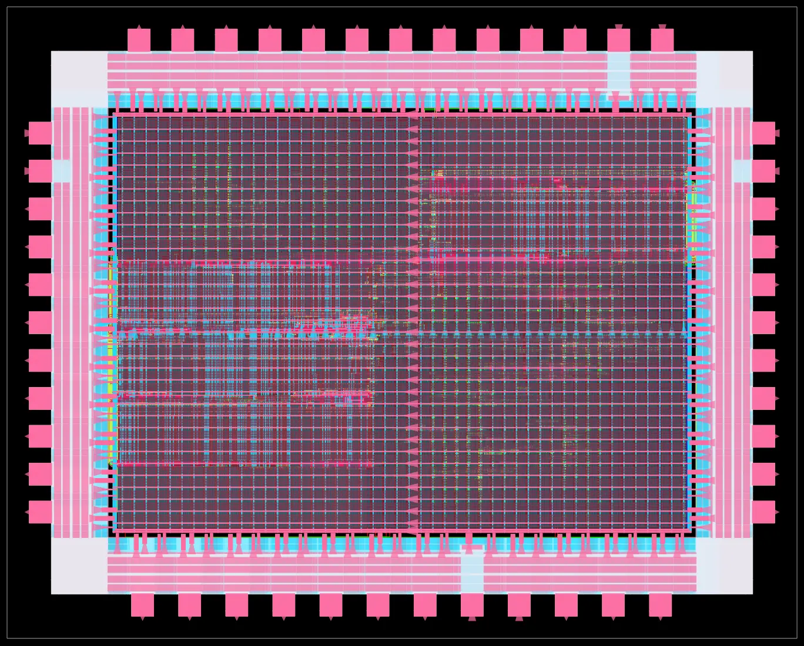

# S1-C — the whole chip, with pads

*Run 2026-09-05. Milestone S1-C of [TAPEOUT_PLAN.md](../../../docs/TAPEOUT_PLAN.md):
"Pad ring, floorplan with several memory blocks placed, power grid, clock tree,
routing. Timing met across the whole chip, zero routing violations."*



A KLayout render of `6_final.gds`. The ring around the edge is the 47 pads; the
six dark rectangles are the SRAM blocks — one per cache and four for main
memory. No silicon involved.

## What this is, and how it differs from P0

P0 hardened the bare processor: no pad ring, no memory blocks, no peripherals.
Its own notes said its 144 MHz was "closes comfortably" on a core-only harden
and not comparable to a finished chip. **This is the finished chip**, and its
numbers are chip numbers: every path here runs from a real input pad, through
the pad's own delay, into the logic, and back out through an output pad.

## Results

| Metric | Value |
|---|---|
| Die | 2500 × 2000 µm |
| Design area | 1,452,940 µm² @ **62% utilisation** |
| **Maximum frequency** | **107.72 MHz** (period_min 9.28 ns) |
| Worst setup slack | **+0.72 ns** against the 10 ns constraint |
| TNS / WNS | 0.00 / 0.00 |
| **Router DRC** | **0 violations** (`5_route_drc.rpt` empty) |
| Power grid | all VDD and VSS shapes connected; worst IR drop 0.294 mV (0.02%) |
| Power | 4.34 mW |
| GDS | `6_final.gds`, 99.2 MB |

### What is on the die

| | count | area µm² |
|---|---|---|
| SRAM blocks | 6 | 900,614 |
| Input pads | 21 | 302,400 |
| Output pads | 18 | 259,200 |
| Supply pads | 8 | 115,200 |
| Pad spacers | 171 | 612,000 |
| Sequential cells | 4,995 | 244,699 |
| Combinational cells | 20,701 | 223,814 |
| **Total instances** | **117,101** | |

21 input plus 18 output is the 39 signal pads the generator emits, and 8 supply
pads makes 47 — the count matches what `tools/gen_padring.py` wrote, which is
the cheapest possible check that the ring is the one that was designed.

## Against the reference

The project measures itself against
[noah-gigler/hft-chip](https://github.com/noah-gigler/hft-chip), which took a
design to this same process with open tools (TAPEOUT_PLAN.md §4a).

| | hft-chip | TinyTrust S1 |
|---|---|---|
| Process | IHP SG13G2 130 nm | same |
| Die | 2500 × 2000 µm, QFN-64 | same |
| Utilisation | 54% | 62% |
| Maximum frequency | 112 MHz (1.08 ns slack at 10 ns) | **107.7 MHz** (0.72 ns slack at 10 ns) |
| Power | 269 mW | 4.34 mW |
| DRC | clean | router clean; signoff pending |
| LVS | clean, with Calibre | pending, with **KLayout** |

Same process, same die, comparable density, and within 4% on frequency against
the same constraint. The power difference is not a win — theirs is a much
larger design doing arithmetic every cycle, while this one spends most of its
time waiting for a serial port.

The LVS row is the interesting one. hft-chip used Calibre, which is commercial.
The platform ships `lvs/sg13g2.lvs` and `run_lvs.py` driven by KLayout, so this
chip's whole path from source to signoff stays open-source.

## What this does NOT establish

- **Signoff DRC and LVS are not in the table above yet.** The 0 violations is
  the *router's* own check, which is not the same thing as KLayout's rule deck.
  Both are running; this file is updated when they land.
- **No gate-level simulation** of the routed netlist. The design is verified at
  RTL — 44/44 proofs, zero co-simulation disagreements, and a whole-chip test
  that boots and runs a program — but nothing has yet re-run those against
  `6_final.v`.
- **The output pads are underdriven.** Every output pad violates its slew limit:
  4 mA drivers against the 5 pF board load the constraints assume, giving
  4.68 ns against a 1.20 ns limit. The platform's own reference design uses
  16 mA pads for general I/O and that is the fix; 5 pF is a realistic load, so
  the answer is a stronger driver rather than a softer assumption. Numbers above
  are otherwise unaffected — this is an off-chip signal integrity problem, not a
  timing-closure one.
- **A hold path sits at exactly 0.00 slack** against a 0.48 ns library hold
  requirement. This is the risk the memory-block smoke test predicted in
  writing: "every flop feeding a cache array will start hold-critical and needs
  margin budgeted." It arrived exactly where that note said it would.
- **No package.** QFN-64 is the target footprint, and the bond diagram is not
  drawn.

## Reproducing

```bash
# once, to work around the memory-block Liberty defect
bash pd/designs/sram_smoke/patch_sram_lib.sh

# then, in WSL as root (the toolchain was installed as root)
source /opt/OpenROAD-flow-scripts/env.sh
cd /opt/OpenROAD-flow-scripts/flow
make DESIGN_CONFIG=/mnt/e/tinytrust/pd/designs/tinytrust_soc/config.mk
make DESIGN_CONFIG=... drc lvs
```

Toolchain as P0: OpenROAD `26Q3-1278-g4421880472`, Yosys `0.68+`, KLayout
`0.30.7`.

### Three things that cost a run each

1. **A duplicated Liberty file.** Setting `FOOTPRINT_TCL` makes the platform add
   the IO libraries itself. Re-declaring the *typ* one gives ABC two cells of
   every name and it dies inside its own cell hash — `Abc_SclHashCells:
   Assertion '*pPlace == -1' failed`. Nothing in that message mentions
   libraries. Sibling of the `ADDITIONAL_LIBS` finding in the smoke test.
2. **`remove_from_collection` is not an OpenSTA command.** Rewriting the
   constraints against the platform's own pad-ring reference corrected
   something more important than the syntax: with a pad ring the clock must be
   created on the pad's *core-side output pin*, not the package port, and
   ordinary pins need a virtual clock because they really are asynchronous to
   the core.
3. **Supply pads get deleted by synthesis.** They have no ports and drive
   nothing, so they are dead logic by any reasonable measure. The failure
   appears two stages later, from a different tool, naming an instance that
   looks like it should exist: `[ERROR PAD-0102] Unable to find instance:
   sg13g2_IOPad_vdd1`. `(* keep *)` holds them.
